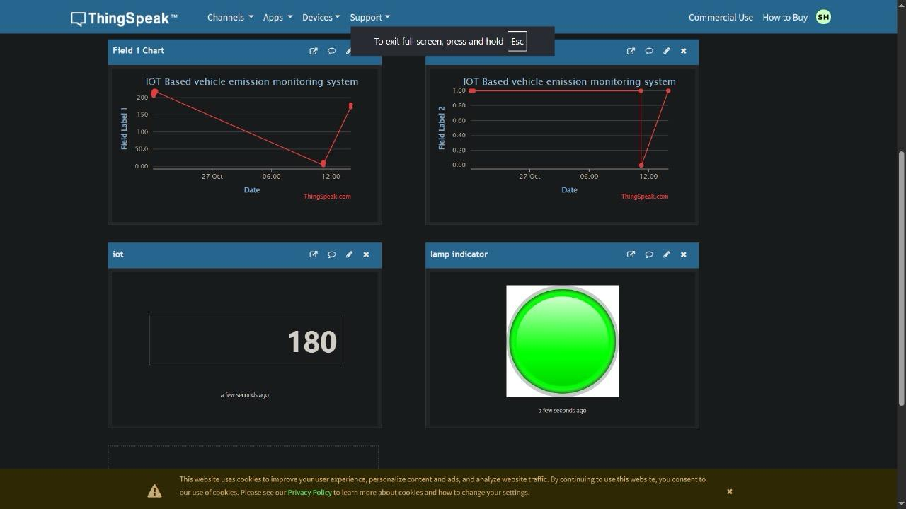

IoT-Based Vehicle Emission Monitoring System

Introduction

Vehicle emissions are a major source of air pollution in urban areas. This project presents an IoT-based solution that continuously monitors vehicle exhaust emissions and uploads the data to the cloud for real-time analysis and tracking.

Problem Statement

Traditional emission testing is periodic and cannot detect excessive emissions during regular vehicle operation. This project provides continuous monitoring and instant reporting of harmful pollutants.

Proposed Solution

The system uses an ESP8266 microcontroller connected to MQ2, MQ7, and MQ135 gas sensors to detect smoke, carbon monoxide, and air-quality-related pollutants. GPS provides location tracking, while GSM/Internet connectivity uploads the collected data to the ThingSpeak cloud platform for remote monitoring.

Hardware Components

* ESP8266 Microcontroller
* MQ2 Smoke Sensor
* MQ7 Carbon Monoxide Sensor
* MQ135 Air Quality Sensor
* GPS Module
* GSM Module
* Buzzer
* LED Indicators

Software & Technologies

* Arduino IDE
* Embedded C/C++
* ThingSpeak Cloud
* IoT Communication Protocols
* GPS Tracking

System Architecture

Gas Sensors → ESP8266 → GPS/GSM Module → ThingSpeak Cloud → Remote Monitoring Dashboard

Key Features

* Real-time emission monitoring
* Cloud-based data visualization
* GPS-enabled vehicle tracking
* Pollution threshold alerts
* Remote access through mobile and desktop devices
* Low-cost and scalable implementation

Applications

* Smart Cities
* Environmental Monitoring
* Fleet Management
* Vehicle Pollution Control
* Government Pollution Monitoring Programs

Results

The system successfully detects pollutant levels, records location information, and uploads data to the cloud dashboard for continuous monitoring and analysis.

Future Enhancements

* Mobile application integration
* AI-based emission prediction
* Automatic compliance reporting
* Advanced analytics dashboard

Team Members

* Srihari S
* Logesh Babu R
* Mathan S
* Mohammed Irfan S

License

This project is developed for academic and learning purposes.

## Project Output

### ThingSpeak Dashboard

### Demonstration Video
The project demonstration video can be viewed from the file:
- output video.mp4
